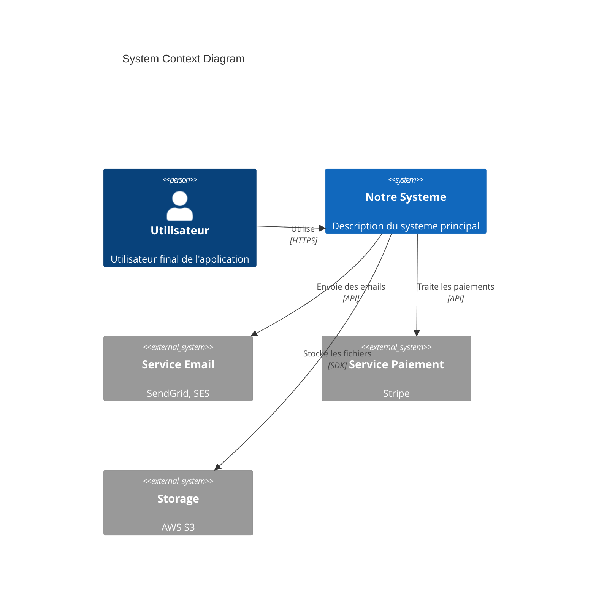
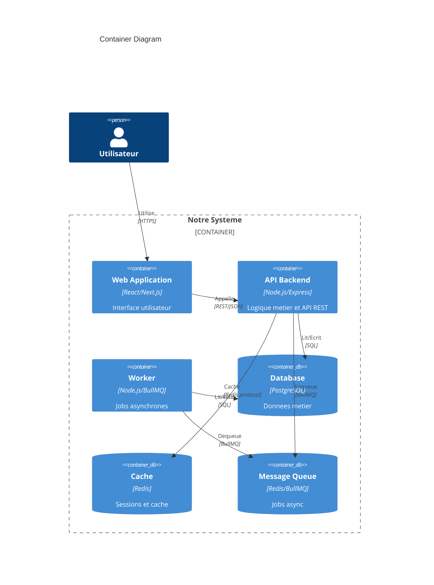
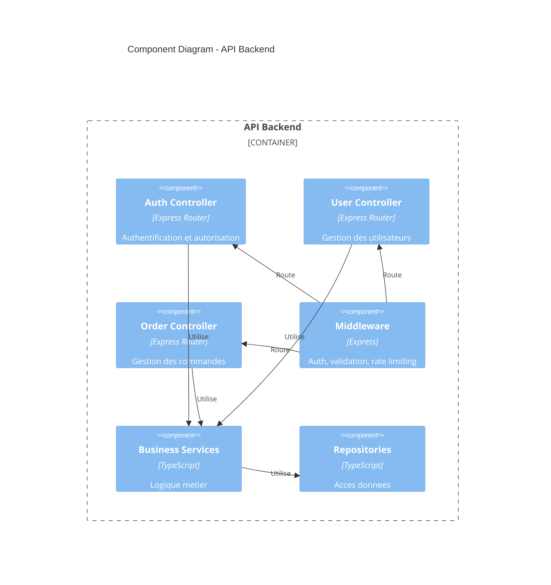
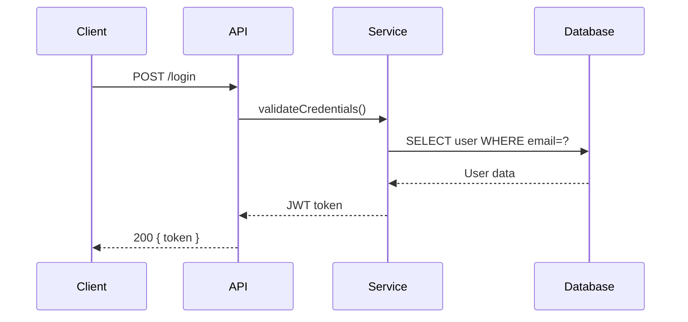
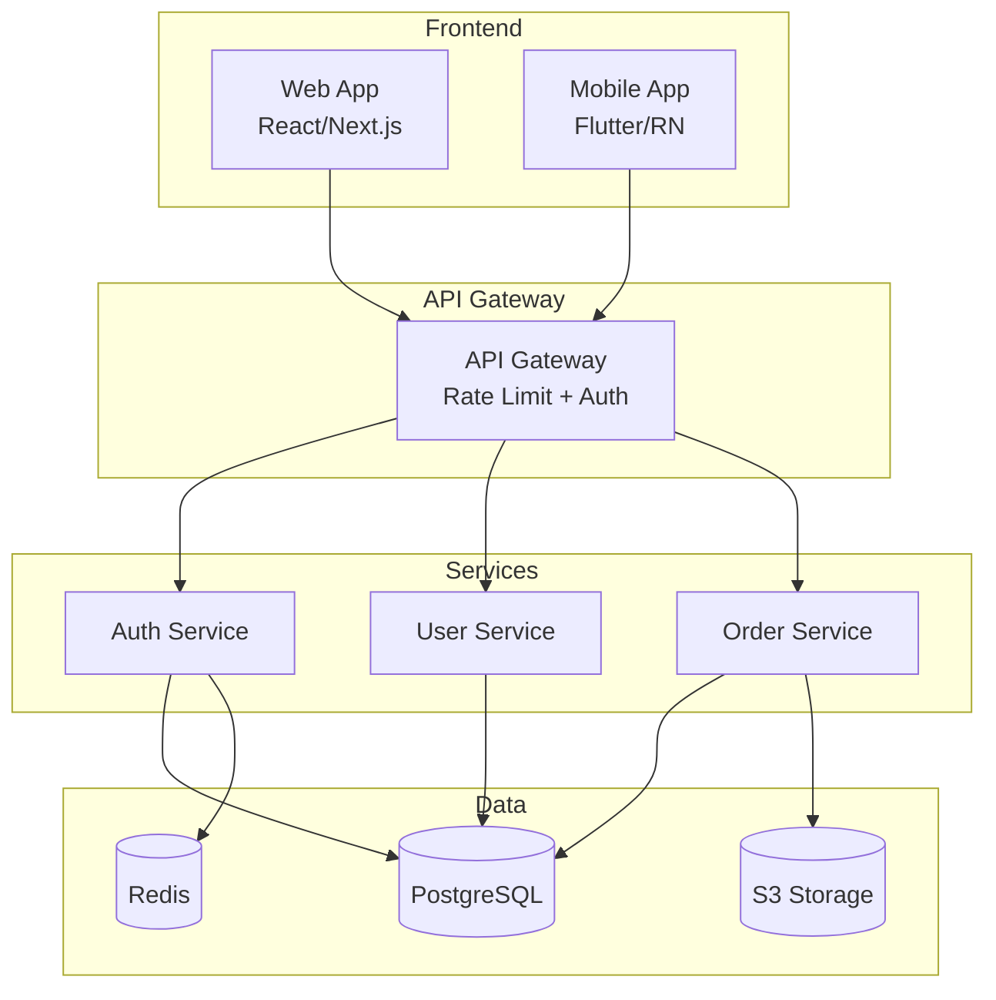

# Agent ARCHITECTURE

Documente l'architecture technique d'un projet de manière claire et maintenable.

## Projet
$ARGUMENTS

## Objectif

Créer une documentation d'architecture qui permet aux développeurs de comprendre
le système, ses composants et leurs interactions.

## Structure de documentation

```
┌─────────────────────────────────────────────────────────────┐
│                    ARCHITECTURE DOC                          │
├─────────────────────────────────────────────────────────────┤
│                                                             │
│  1. OVERVIEW      → Vue d'ensemble du système              │
│  ════════════                                               │
│                                                             │
│  2. COMPOSANTS    → Description des modules                │
│  ═════════════                                              │
│                                                             │
│  3. DATA FLOW     → Flux de données                        │
│  ═══════════                                                │
│                                                             │
│  4. INTÉGRATIONS  → Services externes                      │
│  ══════════════                                             │
│                                                             │
│  5. DÉCISIONS     → ADRs (Architecture Decision Records)   │
│  ═══════════                                                │
│                                                             │
│  6. DÉPLOIEMENT   → Infrastructure et environnements       │
│  ═════════════                                              │
│                                                             │
└─────────────────────────────────────────────────────────────┘
```

## Template de documentation

### 1. Vue d'ensemble

```markdown
# Architecture de [Nom du Projet]

## Vue d'ensemble

### Description
[Description en 2-3 phrases du système et de son objectif]

### Diagramme de contexte

\`\`\`
┌─────────────────────────────────────────────────────────────┐
│                         SYSTÈME                              │
│                                                             │
│  ┌─────────┐     ┌─────────┐     ┌─────────┐              │
│  │ Frontend│────▶│   API   │────▶│Database │              │
│  └─────────┘     └─────────┘     └─────────┘              │
│       │               │               │                    │
│       ▼               ▼               ▼                    │
│  [Utilisateurs]  [Services]     [Storage]                 │
│                                                             │
└─────────────────────────────────────────────────────────────┘

Acteurs externes:
- Utilisateurs finaux (Web, Mobile)
- Services tiers (Stripe, SendGrid, etc.)
- Systèmes internes (CRM, ERP, etc.)
\`\`\`

### Stack technique

| Couche | Technologie | Version | Justification |
|--------|-------------|---------|---------------|
| **Frontend** | React | 18.x | SPA moderne, écosystème riche |
| **Backend** | Node.js/Express | 20.x | JavaScript fullstack |
| **Database** | PostgreSQL | 15.x | Relationnel, ACID, JSON support |
| **Cache** | Redis | 7.x | Performance, sessions |
| **Queue** | BullMQ | 4.x | Jobs async, retries |
| **Search** | Elasticsearch | 8.x | Full-text search |

### Principes architecturaux

1. **Séparation des responsabilités** - Chaque service a un rôle unique
2. **API-first** - Toute fonctionnalité accessible via API
3. **Stateless** - Services sans état pour scalabilité horizontale
4. **Observability** - Logs, métriques et traces sur tout le système
```

### 2. Composants

```markdown
## Composants du système

### Diagramme des composants

\`\`\`
┌─────────────────────────────────────────────────────────────┐
│                     ARCHITECTURE LOGIQUE                     │
├─────────────────────────────────────────────────────────────┤
│                                                             │
│  PRESENTATION LAYER                                         │
│  ┌─────────────────────────────────────────────────────┐   │
│  │  Web App (React)  │  Mobile App (RN)  │  Admin (React)│  │
│  └─────────────────────────────────────────────────────┘   │
│                           │                                 │
│  API GATEWAY                                                │
│  ┌─────────────────────────────────────────────────────┐   │
│  │  Auth  │  Rate Limit  │  Routing  │  Validation     │   │
│  └─────────────────────────────────────────────────────┘   │
│                           │                                 │
│  BUSINESS LAYER                                             │
│  ┌───────────┐ ┌───────────┐ ┌───────────┐ ┌───────────┐  │
│  │   User    │ │  Product  │ │   Order   │ │  Payment  │  │
│  │  Service  │ │  Service  │ │  Service  │ │  Service  │  │
│  └───────────┘ └───────────┘ └───────────┘ └───────────┘  │
│                           │                                 │
│  DATA LAYER                                                 │
│  ┌───────────┐ ┌───────────┐ ┌───────────┐ ┌───────────┐  │
│  │ PostgreSQL│ │   Redis   │ │    S3     │ │Elasticsearch│ │
│  └───────────┘ └───────────┘ └───────────┘ └───────────┘  │
│                                                             │
└─────────────────────────────────────────────────────────────┘
\`\`\`

### Détail des composants

#### User Service

**Responsabilité :** Gestion des utilisateurs et authentification

**Technologies :**
- Framework : Express.js
- Auth : JWT + Refresh tokens
- Stockage : PostgreSQL

**API principale :**
| Endpoint | Méthode | Description |
|----------|---------|-------------|
| `/users` | GET | Liste des utilisateurs |
| `/users/:id` | GET | Détail utilisateur |
| `/auth/login` | POST | Authentification |
| `/auth/refresh` | POST | Renouvellement token |

**Dépendances :**
- PostgreSQL (stockage)
- Redis (sessions, cache)
- SendGrid (emails)

**Schéma de données :**
\`\`\`sql
CREATE TABLE users (
  id UUID PRIMARY KEY,
  email VARCHAR(255) UNIQUE NOT NULL,
  password_hash VARCHAR(255) NOT NULL,
  created_at TIMESTAMP DEFAULT NOW(),
  updated_at TIMESTAMP DEFAULT NOW()
);
\`\`\`

#### [Autre Service]
[Même structure pour chaque service]
```

### 3. Flux de données

```markdown
## Flux de données

### Flux d'authentification

\`\`\`
┌──────┐     ┌──────┐     ┌──────┐     ┌──────┐
│Client│     │ API  │     │ Auth │     │  DB  │
└──┬───┘     └──┬───┘     └──┬───┘     └──┬───┘
   │            │            │            │
   │ 1. POST /login          │            │
   │──────────▶│            │            │
   │            │ 2. Validate           │
   │            │──────────▶│            │
   │            │            │ 3. Query  │
   │            │            │──────────▶│
   │            │            │◀──────────│
   │            │            │ 4. User   │
   │            │ 5. Generate JWT        │
   │            │◀──────────│            │
   │ 6. Return tokens        │            │
   │◀──────────│            │            │
   │            │            │            │
\`\`\`

### Flux de commande

\`\`\`
┌──────┐     ┌──────┐     ┌──────┐     ┌──────┐     ┌──────┐
│Client│     │Order │     │Stock │     │Payment│    │Email │
└──┬───┘     └──┬───┘     └──┬───┘     └──┬───┘     └──┬───┘
   │            │            │            │            │
   │ 1. Create order         │            │            │
   │──────────▶│            │            │            │
   │            │ 2. Check stock          │            │
   │            │──────────▶│            │            │
   │            │◀──────────│            │            │
   │            │ 3. Reserve │            │            │
   │            │            │            │            │
   │            │ 4. Process payment      │            │
   │            │────────────────────────▶│            │
   │            │◀────────────────────────│            │
   │            │            │            │            │
   │            │ 5. Confirm order        │            │
   │◀──────────│            │            │            │
   │            │            │            │            │
   │            │ 6. Send confirmation    │            │
   │            │──────────────────────────────────▶│
   │            │            │            │            │
\`\`\`

### Event flow (si event-driven)

| Event | Publisher | Subscribers | Payload |
|-------|-----------|-------------|---------|
| `user.created` | User Service | Email, Analytics | `{ userId, email }` |
| `order.placed` | Order Service | Stock, Payment, Email | `{ orderId, items }` |
| `payment.completed` | Payment Service | Order, Email | `{ orderId, amount }` |
```

### 4. Intégrations

```markdown
## Intégrations externes

### Services tiers

| Service | Usage | Criticité | Fallback |
|---------|-------|-----------|----------|
| **Stripe** | Paiements | Critique | Queue et retry |
| **SendGrid** | Emails | Haute | Queue + logs |
| **AWS S3** | Storage | Haute | - |
| **Twilio** | SMS | Moyenne | Email fallback |
| **DataDog** | Monitoring | Moyenne | CloudWatch |

### Diagramme d'intégrations

\`\`\`
┌─────────────────────────────────────────────────────────────┐
│                     NOTRE SYSTÈME                            │
├─────────────────────────────────────────────────────────────┤
│                                                             │
│                    ┌───────────────┐                        │
│                    │   API Core    │                        │
│                    └───────┬───────┘                        │
│                            │                                │
│   ┌────────────────────────┼────────────────────────┐      │
│   │                        │                        │      │
│   ▼                        ▼                        ▼      │
│ ┌─────┐               ┌─────────┐              ┌──────┐   │
│ │Stripe│               │SendGrid │              │  S3  │   │
│ └─────┘               └─────────┘              └──────┘   │
│ Paiements              Emails                  Storage    │
│                                                             │
└─────────────────────────────────────────────────────────────┘
\`\`\`

### Contrats d'API

#### Stripe Integration

\`\`\`typescript
// Configuration
const stripe = new Stripe(process.env.STRIPE_SECRET_KEY);

// Création de paiement
interface PaymentIntent {
  amount: number;        // En centimes
  currency: string;      // 'eur', 'usd'
  customerId: string;    // Stripe customer ID
  metadata: {
    orderId: string;
    userId: string;
  };
}

// Webhooks écoutés
// - payment_intent.succeeded
// - payment_intent.failed
// - customer.subscription.updated
\`\`\`
```

### 5. Décisions d'architecture (ADRs)

```markdown
## Architecture Decision Records

### ADR-001: Choix de PostgreSQL comme base principale

**Status:** Accepté
**Date:** 2024-01-15
**Décideurs:** [Noms]

#### Contexte
Nous devons choisir une base de données pour stocker les données métier.
Le système doit supporter ~10k utilisateurs avec croissance prévisible.

#### Options considérées

| Option | Avantages | Inconvénients |
|--------|-----------|---------------|
| PostgreSQL | ACID, JSON, mature | Scaling horizontal complexe |
| MongoDB | Flexible, scale | Pas de transactions ACID |
| MySQL | Populaire, performant | Moins de features que PG |

#### Décision
PostgreSQL pour :
- Transactions ACID nécessaires pour les paiements
- Support JSON pour flexibilité
- Extensions (PostGIS si besoin géo)
- Excellente documentation

#### Conséquences
- ✅ Transactions fiables
- ✅ Flexibilité du schéma avec JSONB
- ⚠️ Scaling vertical en priorité
- ⚠️ Besoin de read replicas si charge élevée

---

### ADR-002: Architecture API REST vs GraphQL

**Status:** Accepté
**Date:** 2024-01-20

[Même structure]
```

### 6. Déploiement

```markdown
## Infrastructure et déploiement

### Architecture de déploiement

\`\`\`
┌─────────────────────────────────────────────────────────────┐
│                    PRODUCTION                                │
├─────────────────────────────────────────────────────────────┤
│                                                             │
│  ┌─────────────────────────────────────────────────────┐   │
│  │                    CloudFlare                        │   │
│  │                    (CDN + WAF)                       │   │
│  └─────────────────────────────────────────────────────┘   │
│                           │                                 │
│                           ▼                                 │
│  ┌─────────────────────────────────────────────────────┐   │
│  │                  Load Balancer                       │   │
│  │                    (AWS ALB)                         │   │
│  └─────────────────────────────────────────────────────┘   │
│                           │                                 │
│          ┌────────────────┼────────────────┐               │
│          ▼                ▼                ▼               │
│     ┌─────────┐     ┌─────────┐     ┌─────────┐          │
│     │ API #1  │     │ API #2  │     │ API #3  │          │
│     │ (ECS)   │     │ (ECS)   │     │ (ECS)   │          │
│     └─────────┘     └─────────┘     └─────────┘          │
│          │                │                │               │
│          └────────────────┼────────────────┘               │
│                           ▼                                 │
│  ┌───────────┐     ┌───────────┐     ┌───────────┐        │
│  │PostgreSQL │     │   Redis   │     │    S3     │        │
│  │  (RDS)    │     │(ElastiC.) │     │           │        │
│  └───────────┘     └───────────┘     └───────────┘        │
│                                                             │
└─────────────────────────────────────────────────────────────┘
\`\`\`

### Environnements

| Environnement | URL | Infra | Usage |
|---------------|-----|-------|-------|
| **Development** | localhost | Docker Compose | Dev local |
| **Staging** | staging.example.com | AWS (réduit) | Tests intégration |
| **Production** | api.example.com | AWS (complet) | Utilisateurs réels |

### Configuration par environnement

| Variable | Dev | Staging | Prod |
|----------|-----|---------|------|
| `NODE_ENV` | development | staging | production |
| `DB_HOST` | localhost | staging-db.xxx | prod-db.xxx |
| `LOG_LEVEL` | debug | info | warn |
| `REPLICAS` | 1 | 2 | 3-10 (auto) |

### Scaling

| Composant | Strategy | Triggers |
|-----------|----------|----------|
| API | Horizontal (ECS) | CPU > 70%, Memory > 80% |
| Database | Vertical + Read Replicas | Connections, CPU |
| Redis | Cluster mode | Memory > 80% |
| Workers | Horizontal | Queue depth |
```

## Diagrammes C4 avec Mermaid

### Niveau 1 : Context Diagram



### Niveau 2 : Container Diagram



### Niveau 3 : Component Diagram



### Diagramme de sequence (flux)



### Diagramme d'architecture (flowchart)



### Templates de diagrammes ASCII (fallback)

```markdown
### Niveau 1 : Context

\`\`\`
[Utilisateur] --> [Systeme] --> [Systemes externes]
\`\`\`

### Niveau 2 : Container

\`\`\`
[Web App] --> [API] --> [Database]
                  └──> [Cache]
\`\`\`

### Niveau 3 : Component

\`\`\`
[API]
├── AuthController
├── UserController
├── OrderController
└── PaymentController
\`\`\`
```

## Checklist documentation

```markdown
## Checklist Architecture Doc

### Essentiel
- [ ] Vue d'ensemble du système
- [ ] Stack technique avec justifications
- [ ] Diagramme des composants
- [ ] Flux de données principaux
- [ ] Configuration des environnements

### Recommandé
- [ ] ADRs pour décisions importantes
- [ ] Intégrations documentées
- [ ] Schémas de données
- [ ] SLAs et métriques
- [ ] Procédures de déploiement

### Maintenance
- [ ] Date de dernière mise à jour
- [ ] Responsable de la documentation
- [ ] Process de mise à jour
```

## Agents liés

| Agent | Quand l'utiliser |
|-------|------------------|
| `/readme` | Documentation README |
| `/api-spec` | Documentation API |
| `/infra-code` | Infrastructure as Code |
| `/onboard` | Onboarding développeurs |
| `/explore` | Explorer le code existant |

---

IMPORTANT: La documentation d'architecture doit être maintenue à jour.

YOU MUST inclure les justifications des choix techniques (ADRs).

YOU MUST documenter les flux de données critiques.

NEVER avoir une documentation qui diverge de la réalité.

Think hard sur ce qu'un nouveau développeur a besoin de savoir.
